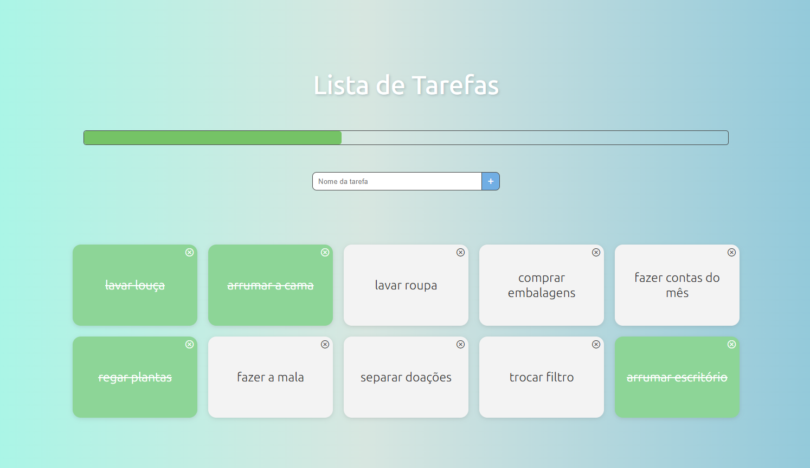

# Desafio  | Tarefas(TODO)

## Descrição

Projeto proposto no [Curso Vue JS 2](https://www.udemy.com/course/vue-js-completo/?couponCode=THANKSLEARNER24), o desafio consiste em criar através de um input cards de tarefas que podem ser marcadas como feitas ou excluídas, assim como uma barra de status que mostre a porcentagem das tarefas concluídas.
